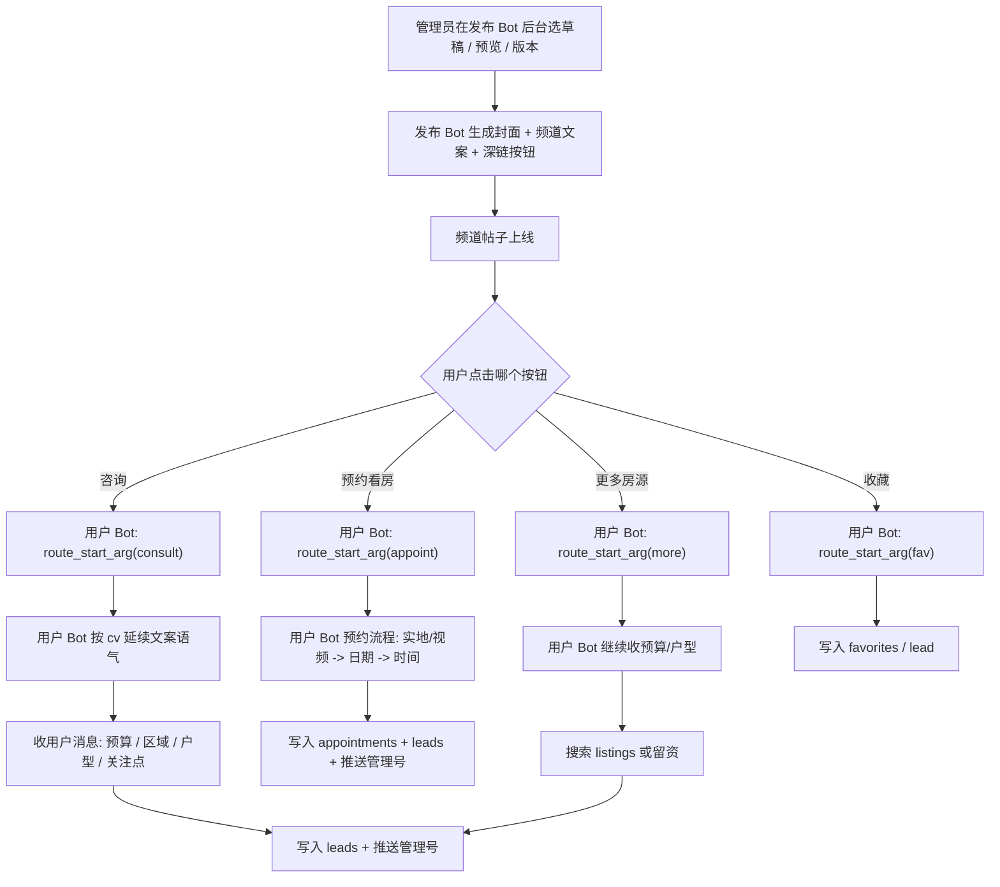

# 两机器人协作与文案规划（落地版）

## 目标
- 让 `发布机器人（@Meihua666bot）` 负责“发对内容”。
- 让 `用户机器人` 负责“接住咨询并转化”。
- 文案从频道到私聊保持同一语气，减少用户跳失。

## 协作链路
1. 发布机器人发频道帖（封面 + 文案 + 深链按钮）。
2. 用户点击 `咨询/预约/更多` 深链进入用户机器人。
3. 用户机器人识别来源（post token / listing_id / 文案版本）。
4. 用户机器人给出匹配话术，引导用户提交预算、区域、入住时间。
5. 线索写入 `leads`，预约写入 `appointments`，顾问继续跟进。

## 功能交接表
- 发布机器人负责发帖前半段：草稿审核、选 A/B/C 文案版本、生成封面、发频道、挂深链按钮。
- 用户机器人负责发帖后半段：承接咨询、收集想住需求、收集找房条件、预约看房、推送管理号。
- 交接触发点只有一个：用户点击频道帖里的深链按钮。
- 交接时必须带上的最小数据：
  - `listing_id`
  - `post_token`
  - `caption_variant / cv`
  - `action`（consult / appoint / fav / more）
- 发布机器人不负责长对话；用户机器人不负责频道排版和审核。

### 代码落点
- 发布侧文案与版本：
  - `meihua_publisher.py -> build_chinese_listing_post()`
- 发布侧交接按钮：
  - `meihua_publisher.py -> build_start_payload()`
  - `meihua_publisher.py -> build_keyboard()`
- 发布执行：
  - `autopilot_publish_bot.py -> on_preview_callback()`
  - `meihua_publisher.py -> publish_draft() / _tg_publish()`
- 用户侧接手：
  - `qiaolian_dual/user_bot.py -> route_start_arg()`
- 用户侧继续流程：
  - `qiaolian_dual/user_bot.py -> handle_main_message()`
  - `qiaolian_dual/user_bot.py -> handle_find_budget()`
  - `qiaolian_dual/user_bot.py -> appoint_flow_cb()`

### 运营口径
- 频道里只做 3 件事：吸引点击、降低顾虑、把人引到私聊。
- 私聊里只做 3 件事：确认意图、少量收集关键信息、推送管理号。
- 不要让两个 Bot 都做“解释全部流程”；频道讲入口，私聊讲落地。

## 完整流程图


## 按钮归属
- 频道帖子上的按钮：
  - `💬 点击咨询` -> 发布 Bot 生成按钮，用户 Bot 接手私聊
  - `📅 预约看房` -> 发布 Bot 生成按钮，用户 Bot 接手预约流程
  - `🏠 更多房源` -> 发布 Bot 生成按钮，用户 Bot 接手继续筛选
- 用户 Bot 主菜单：
  - `🔍 找房` -> 用户 Bot 自己处理
  - `🏡 想住需求` -> 用户 Bot 自己处理并推送管理号
  - `📅 我的预约` -> 用户 Bot 自己读取预约记录
  - `🛡️ 服务承诺` -> 用户 Bot 自己展示说明
  - `💬 联系管理` -> 用户 Bot 收消息并推送管理号

## 谁不该做什么
- 发布 Bot 不该做：
  - 长对话
  - 收预算/区域/入住时间
  - 做预约表单
  - 直接承接用户聊天
- 用户 Bot 不该做：
  - 频道封面渲染
  - 草稿审核与频道发帖
  - A/B/C 发帖预览
  - 管理员后台发布操作

## 最小交接协议
- 发布 Bot 交给用户 Bot 的最小上下文：
  - `action`
  - `listing_id`
  - `post_token`
  - `cv`
- 用户 Bot 接到后必须先做：
  - 识别 `action`
  - 优先读取 `cv`
  - 初始化对应会话状态
  - 后续消息统一推送管理号

## 文案分工（重点）
- 频道文案（发布机器人）负责：吸引点击。
- 私聊首句（用户机器人）负责：降低回复门槛。
- 私聊确认句（用户机器人）负责：增强信任与“有人跟进”的确定感。

## 文案版本策略（A/B/C）
- `A`：标准信任型（稳）
- `B`：效率成交型（快）
- `C`：透明解释型（细）

说明：
- 现在发布端 `A/B/C` 已是三套不同结构，不再是同文案换标记。
- 深链会携带 `cv=a|b|c`，用户机器人优先按深链版本承接；缺失时再回退读取 `draft.review_note`。
- 用户机器人会自动切换首句与确认语气，形成“频道看到什么语气，私聊就延续什么语气”的闭环。

## 用户机器人承接脚本（建议固定执行）
1. 首句承接（按 A/B/C）：
   - A：标准信任型，引导“直接说问题”。
   - B：效率成交型，引导“预算 + 入住时间”。
   - C：透明解释型，引导“押金/通勤/楼层采光等关注点”。
2. 二次确认：
   - A：`已推送管理号跟进`。
   - B：`已加急推送管理号`。
   - C：`已按关注点推送管理号逐项确认`。
3. 留资最低结构（统一）：
   - 预算区间（USD/月）
   - 区域
   - 入住时间
   - 户型偏好
4. 顾问接手前，不问太多开放题，减少用户输入负担。

## 图片与文字组合建议
- 图片固定 5 板式：`magazine_white / dark_glass / metro_panel / lite_strip / royal_card`
- 文字固定 5 模板：`s1~s5`
- 建议先跑 2 周实验：
  - 周一三五：`metro_panel + s4`
  - 周二四六：`lite_strip + s2`
  - 周日：`royal_card + s3`

## 运营节奏（每天）
1. 上午：发 1 条主推（高质量实拍）。
2. 下午：发 1 条性价比（低预算段）。
3. 晚间：发 1 条“可立即看房”。
4. 当天复盘：看 `consult_click -> consult_message` 转化。

## 关键数据看板（最少跟这 4 个）
- `consult_click`（点咨询）
- `consult_message`（真正发来需求）
- `appointment_click`
- `appointment_submit`

核心转化：
- 点击咨询率 = `consult_click / 曝光`
- 咨询落地率 = `consult_message / consult_click`
- 预约转化率 = `appointment_submit / consult_message`

## 执行命令（示例）
```bash
cd /opt/qiaolian_dual_bots

# 先看一条 dry-run
./.venv/bin/python tools/publish_houses_csv.py \
  --csv data/houses.csv \
  --kind metro_panel \
  --text-style s4 \
  --limit 1 \
  --dry-run

# 正式发
./.venv/bin/python tools/publish_houses_csv.py \
  --csv data/houses.csv \
  --kind metro_panel \
  --text-style s4 \
  --limit 1
```
