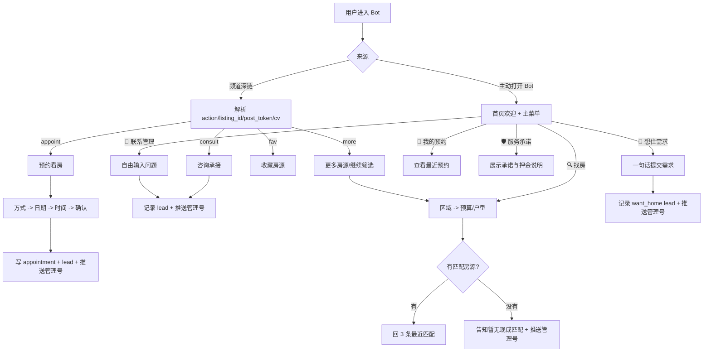

# 用户 Bot 全流程规划（落地版）

## 目标

- 用户 Bot 只做一件事：把频道点击，稳稳接成私聊线索。
- 不做顾问分配，只推送到管理号 `ADMIN_IDS`。
- 让用户感受到：有人接、信息少填、问题能继续问。

## 用户 Bot 的职责边界

- 负责：
  - 接深链
  - 承接频道咨询
  - 收集找房条件
  - 收集想住需求
  - 处理预约看房
  - 展示服务承诺
  - 推送管理号
  - 记录 leads / appointments / favorites
- 不负责：
  - 发频道
  - 审草稿
  - 生成封面
  - 选频道排版
  - 后台发布动作

## 与发布 Bot 的交接

- 交接触发点只有一个：用户点击频道帖按钮后进入私聊。
- 发布侧必须带过来的最小字段：
  - `action`
  - `listing_id`
  - `post_token`
  - `cv`
- `action` 只允许：
  - `consult`
  - `appoint`
  - `more`
  - `fav`

## 用户 Bot 的总流程

## 首页流程

### 1. `/start` 或主动打开

- 目标：
  - 先建立信任，再给清楚入口。
- 首页结构建议固定为：
  - 欢迎语
  - 三个可信点：实拍真房源 / 费用尽量讲清 / 管理号跟进
  - 主菜单按钮
- 主菜单固定：
  - `🔍 找房`
  - `🏡 想住需求`
  - `📅 我的预约`
  - `🛡️ 服务承诺`
  - `💬 联系管理`
  - `🏠 返回首页`

## 频道深链承接流程

### 2. `consult` 咨询入口

- 触发：
  - 用户点击频道里的 `💬 点击咨询`
- 用户 Bot 要做的 4 步：
  1. 解析 `listing_id / post_token / cv`
  2. 读取房源上下文
  3. 按 `cv` 输出首句承接
  4. 设置 `awaiting_consult`
- 承接文案规则：
  - `A`：标准信任型
  - `B`：效率成交型
  - `C`：透明解释型
- 用户下一条自由输入后：
  - 识别预算
  - 识别区域
  - 识别户型
  - 保留原文
  - 写入 `leads`
  - 推送管理号
- 给用户的确认语固定：
  - `A`：`已推送管理号跟进`
  - `B`：`已加急推送管理号`
  - `C`：`已按关注点推送管理号逐项确认`

### 3. `appoint` 预约入口

- 触发：
  - 用户点击频道里的 `📅 预约看房`
- 流程固定 4 步：
  1. 选方式：`📅 实地看房` / `📹 视频代看（远程）`
  2. 选日期
  3. 选时间段
  4. 确认提交
- 提交后：
  - 写入 `appointments`
  - 额外写一条 `appointment_submit` lead
  - 推送管理号
- 页面文案原则：
  - 用中文完整表达，不出现 `offline/video`
  - 押金和费用说明写成书面约定口径，不做过度承诺

### 4. `more` 更多房源入口

- 触发：
  - 用户点击频道里的 `🏠 同区域更多`
- 逻辑：
  - 自动带一个区域 hint
  - 直接进入 `找房` 的区域/预算流程
- 目标：
  - 降低用户重输一遍的摩擦

### 5. `fav` 收藏入口

- 触发：
  - 用户点击频道里的 `❤️ 收藏房源`
- 逻辑：
  - 记录 favorite 或 lead touch
  - 给一个轻确认
  - 顺便提供 `预约看房 / 同区域更多`

## 主菜单流程

### 6. `🔍 找房`

- 目标：
  - 用最少两步拿到可用筛选条件。
- 流程：
  1. 让用户发区域
  2. 让用户发预算，可同时带户型
- 状态：
  - `FIND_AREA`
  - `FIND_BUDGET`
- 提交后：
  - 写入 `search_pref_submit`
  - 推送管理号
  - 本地搜最近匹配 3 条
- 输出分两种：
  - 有匹配：先回 3 条
  - 无匹配：明确说已推送管理号继续筛

### 7. `🏡 想住需求`

- 目标：
  - 承接高意向但不一定有具体房号的用户。
- 让用户一句话发完整需求：
  - 预算
  - 区域
  - 户型
  - 入住时间
  - 特别在意点
- 状态：
  - `awaiting_want_home`
- 提交后：
  - 写入 `want_home_message`
  - 推送管理号

### 8. `📅 我的预约`

- 目标：
  - 给用户一个可自查入口，减少反复追问。
- 逻辑：
  - 拉最近预约记录
  - 显示状态、日期、时间、房源号

### 9. `🛡️ 服务承诺`

- 目标：
  - 统一解释“我们能做什么，不能做什么”。
- 固定包含：
  - 实拍房源
  - 费用尽量讲清
  - 押金与争议处理说明
  - 以书面约定和合同附录为准
- 作用：
  - 降低用户在咨询前的心理成本

### 10. `💬 联系管理`

- 目标：
  - 给用户一个不需要理解流程的兜底入口
- 行为：
  - 设置 `awaiting_consult`
  - 用户下一条消息直接作为咨询内容处理

## 内部状态机

### 用户态

- `MAIN`
- `FIND_AREA`
- `FIND_BUDGET`
- `APPT_MODE`
- `APPT_DATE`
- `APPT_TIME`
- `APPT_CONFIRM`

### 临时上下文

- `awaiting_consult`
  - 来源、房源号、文案版本、touch payload
- `awaiting_want_home`
  - 来源、touch payload
- `search_pref`
  - area、source、touch payload
- `appt`
  - listing_id、mode、date、time、source、touch payload

## 管理号推送规则

### 必推 4 类

- `consult_message`
- `want_home_message`
- `search_pref_submit`
- `appointment_submit`

### 推送内容最小字段

- 用户
- 联系方式
- 来源
- 房源编号
- 预算
- 区域
- 户型
- 文案版本
- 原始内容或预约信息

### 原则

- 只推送到 `ADMIN_IDS`
- 不在 Bot 内做顾问分配
- 不在用户端承诺“谁会联系您”

## 文案规划

### 文案目标

- 频道负责把人点进来
- 用户 Bot 负责把人留下来

### 用户 Bot 文案三层

1. 首句承接
  - 让用户愿意发第一句话
2. 过程提示
  - 告诉用户下一步怎么做
3. 确认回执
  - 让用户知道有人跟进

### 用户 Bot 最佳语气

- 中国用户导向
- 金边本地语境
- 可信、实用、少废话
- 不像表单机器人
- 不像销售话术堆砌

## 数据记录规划

### leads 建议统一字段

- `action`
- `source`
- `listing_id`
- `area`
- `property_type`
- `budget_min`
- `budget_max`
- `payload.message`
- `payload.caption_variant`
- `payload.post_token`
- `created_at`

### appointments 建议统一字段

- `user_id`
- `listing_id`
- `viewing_mode`
- `appointment_date`
- `appointment_time`
- `contact_value`
- `status`
- `created_at`

## 不同入口的目标差异

- `consult`：
  - 重点是围绕单个房源继续问
- `want_home`：
  - 重点是帮用户表达总体居住需求
- `search_pref`：
  - 重点是机器先筛，管理号再补
- `appoint`：
  - 重点是把模糊兴趣变成到看房动作

## 体验原则

- 一个入口只做一件事
- 每条路最多两次输入就得到回执
- 任何路径都能回首页
- 无匹配时不要结束会话，要明确“已推送管理号”
- 文案避免“保证、一定、包退”等高风险词

## 我建议的实施优先级

### P0

- 统一所有频道按钮都走新深链协议
- 咨询/想住/找房/预约四类推送全部保留原始内容
- 无匹配时继续引导补充入住时间

### P1

- 收藏房源做成可回看列表
- 我的预约支持取消/改期
- 服务承诺页加常见问题入口

### P2

- 给管理号推送加来源汇总标签
- 做用户回访与二次唤醒
- 做简易漏斗看板

## 一句话定版

- 发布 Bot 负责把人带进门。
- 用户 Bot 负责接住、问少量关键问题、把线索稳稳推送到管理号。

